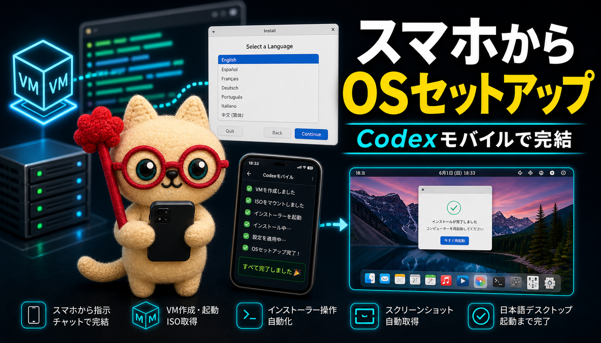
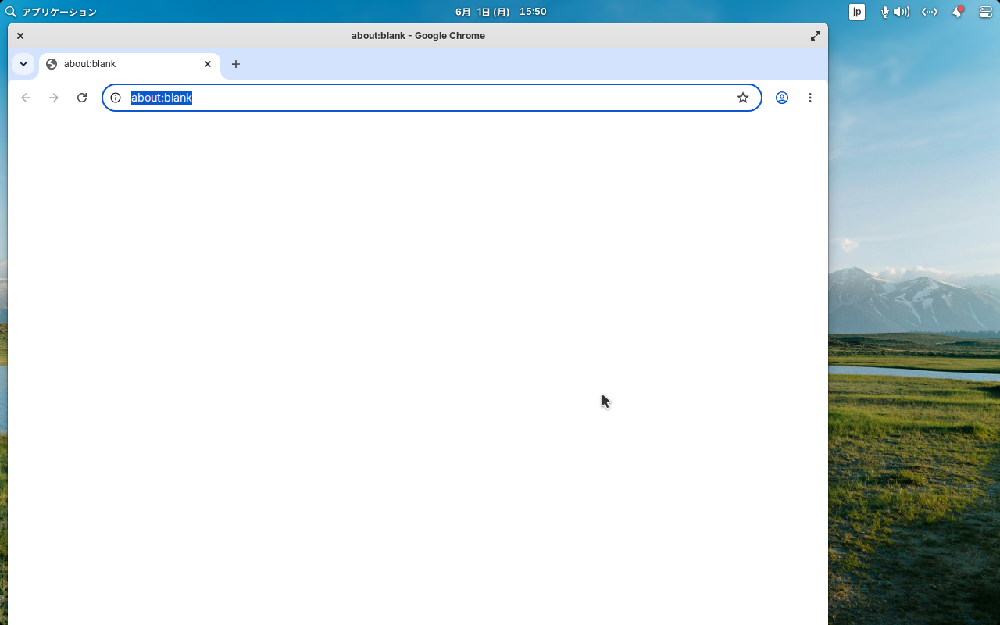
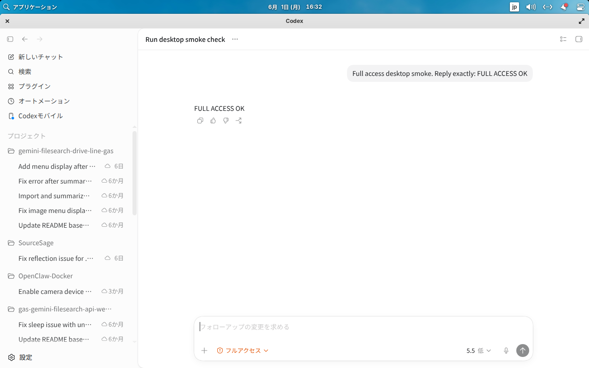
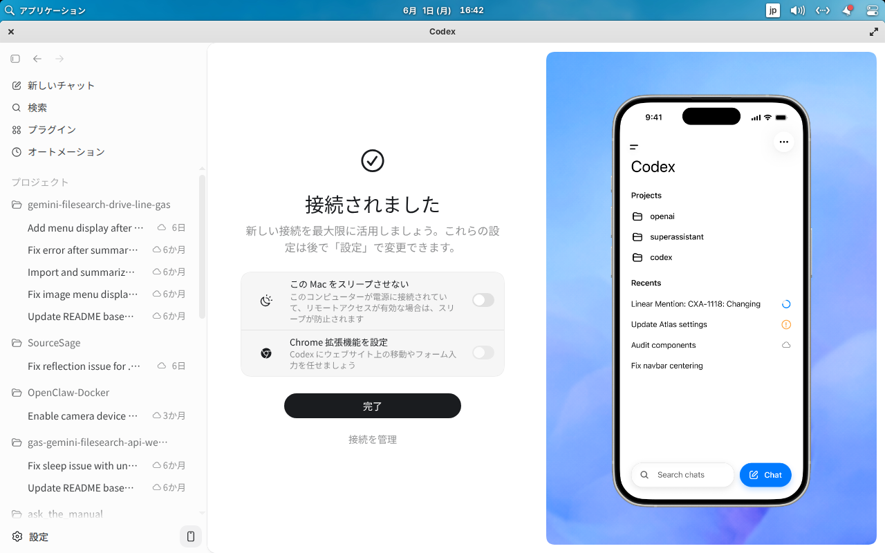
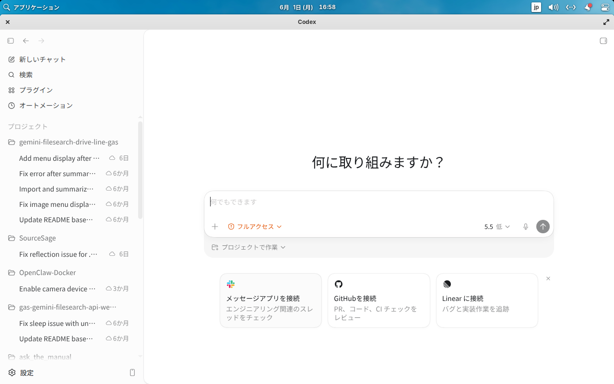
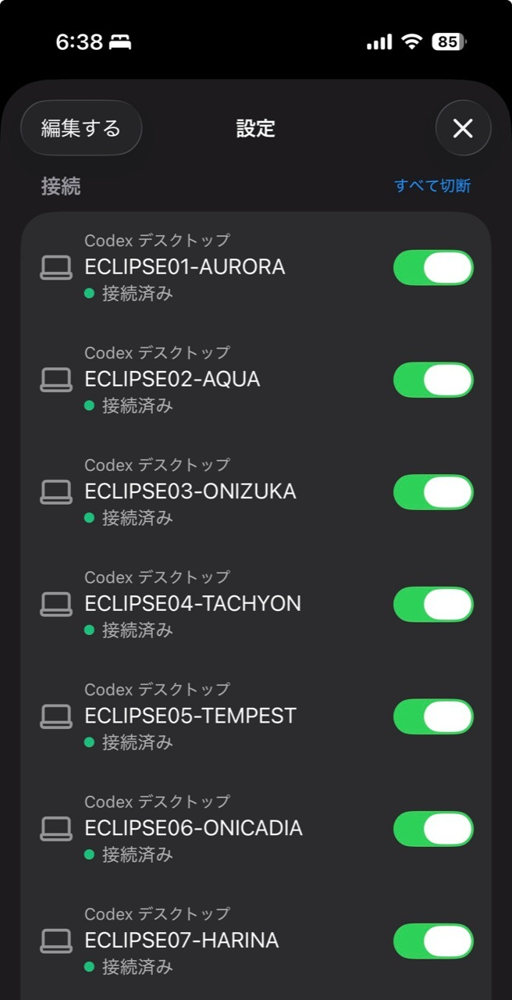

<div align="center">
  
  <h1>Remote Agent Onboarding Skill - ECLIPSE -</h1>
  <p>
    <a href="README.md">English</a> |
    <a href="README.ja.md">日本語</a>
  </p>
  <p>
    <a href="https://github.com/Sunwood-ai-labs/remote-agent-onboarding/actions/workflows/validate.yml"></a>
    <a href="LICENSE"></a>
    
    
    
    
  </p>
</div>

Codex skill for creating, repairing, and verifying a Linux remote-agent workstation with SSH, X11 desktop proof, Codex Desktop, Chrome, Browser/IAB, mobile remote-control, workspace hygiene, and Codex Automations proof surfaces.

The skill is written for operators who need evidence-backed VM readiness rather than package-version-only checks.

## What This Covers

- Ubuntu/Linux remote agent VM setup and repair
- SSH key login, service state, and LAN port reachability checks
- Codex CLI/Desktop launch and live GUI screenshot verification
- Default Codex posture checks for `gpt-5.5`, low reasoning, full access, and no approval prompts
- Persistent Chrome profile setup and CDP checks
- Browser/IAB socket and log verification
- Codex auth migration from another VM without copying target identity fields
- Mobile remote-control daemon, socket, and enrollment checks
- ECLIPSE fleet naming and mobile-visible identity refresh checks
- Per-agent VPN isolation checks for whole-VM outbound traffic
- Codex Automations local-state, UI, and smoke-run verification
- Blank/locked screen prevention and screenshot troubleshooting
- Dedicated workspace setup and reversible local thread cleanup
- Proxmox-oriented VM checks where available

## Install

Clone this repository into your Codex skills directory:

```bash
mkdir -p ~/.codex/skills
git clone https://github.com/Sunwood-ai-labs/remote-agent-onboarding.git \
  ~/.codex/skills/remote-agent-onboarding
```

Then start a new Codex session and ask for a remote-agent VM setup, repair, or verification task.

## Files

- `SKILL.md` - main Codex skill entrypoint
- `agents/openai.yaml` - UI metadata
- `references/codex-automations.md` - detailed Automations verification and smoke-test procedure
- `scripts/validate_repo.py` - repository validation script
- `.github/workflows/validate.yml` - GitHub Actions validation workflow

## Usage Example

```text
Use remote-agent-onboarding to verify this Ubuntu remote-agent VM.
Check SSH, Codex Desktop, Chrome, Browser/IAB, mobile remote control, and Automations as separate proof surfaces.
```

## Release Surface

`SKILL.md` is the source of truth for operator behavior. The README tracks the
same top-level capabilities, but intentionally avoids duplicating every command.
For v0.1.0, the skill emphasizes these guardrails:

- Do not call SSH complete from Proxmox/QGA alone. Verify key login, `sshd`
  enabled/active, port 22 listening, and LAN reachability.
- Do not call Codex Desktop ready from process output alone. Capture and inspect
  a visible Desktop surface, and reject blank, locked, or all-black screenshots.
- Do not infer full-access defaults from config text alone. Smoke-test the
  runtime for model, reasoning effort, sandbox mode, and approval policy.
- Do not claim mobile setup from `remote_control = true` alone. Verify the
  standalone daemon, control socket, and enrollment state.
- Do not copy an entire `.codex` directory between VMs for auth migration. Copy
  minimal auth material and preserve the target VM identity.
- Do not wipe all local Codex threads during cleanup by default. Use confirmed
  smoke-test `THREAD_IDS`; reserve all-history cleanup for explicit requests.
- Keep a dedicated agent workspace and redirect legacy defaults such as
  `~/Documents/Codex` only after backing up existing content.

For v0.2.0, the release extends the same proof-surface discipline from one
remote-agent VM to an ECLIPSE fleet:

- Keep fleet names consistent across hostname, SSH alias, Desktop identity,
  remote-control enrollment, and the current phone/tablet connection list.
- Use the public fleet naming pattern `ECLIPSE01-AURORA`,
  `ECLIPSE02-AQUA`, `ECLIPSE03-ONIZUKA`, `ECLIPSE04-TACHYON`,
  `ECLIPSE05-TEMPEST`, `ECLIPSE06-ONICADIA`, and `ECLIPSE07-HARINA`.
- Treat mobile-visible names as backend-registration state, not as a direct
  mirror of Linux hostnames. A rename is incomplete until a fresh
  `remote-control start` handoff and current mobile proof show the new name.
- Keep cloned VM identity separate from copied Codex authentication. Copy the
  minimum auth material, then regenerate target-local remote-control identity.
- Report per-agent VPN proof separately from Codex proof: service state,
  tunnel interface, external IP/country, and whether LAN SSH still works.
- Avoid exposing installation IDs, environment IDs, server IDs, IP addresses,
  VPN secrets, or account details in public release material.

## Screenshots

These screenshots show the kind of visual proof the skill expects during VM
onboarding: a real desktop session, a usable Codex Desktop window, mobile
remote-control connection, and a clean workspace state.

### Linux Desktop Setup





### Codex Desktop And Mobile








### ECLIPSE Fleet Proof

The v0.2.0 fleet proof shows the mobile-visible naming contract after the
remote-control identity refresh:



## Validation

Run the same checks used by CI:

```bash
python3 scripts/validate_repo.py
git diff --check
```

## Safety Notes

This skill intentionally separates proof surfaces. Do not report a VM as ready until the requested surface has been verified directly.

Before publishing logs, screenshots, or copied VM state, remove:

- credentials, passwords, cookies, and browser profile secrets
- real IPs or hostnames if they identify private infrastructure
- account-specific tokens and OAuth artifacts
- VM images, SSH keys, and `.codex` database files

Automation smoke tests modify the local Codex sqlite database and must back up the DB first. Remove smoke jobs after verification so they do not continue running.

Some setup commands intentionally download official installers or packages. Inspect remote scripts before running them when your environment requires pinning, checksum verification, or a stricter supply-chain policy.

Local thread cleanup can modify `~/.codex/state_5.sqlite` and move session
rollouts. Back up first, target only confirmed smoke-test thread IDs by default,
and distinguish local VM history from account/cloud project history.

## License

MIT. See [LICENSE](LICENSE).
